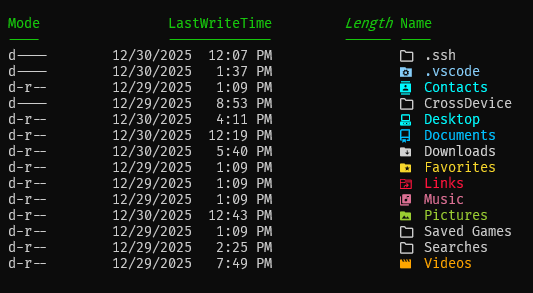

# Oh My Posh Custom Themes 🎨

<div align="center">


</div>

## 📋 Requirements

Before using the custom themes, ensure you have the following installed:

- [Oh My Posh](https://ohmyposh.dev/docs/installation): A prompt theme engine for any shell.
- **Powerline fonts**: Required for proper display of symbols and icons used in themes. You can install them from [Nerd Fonts](https://www.nerdfonts.com).
- A supported shell, such as:
  - PowerShell
  - Bash
  - Zsh
  - Fish

## 🚀 Quick Install

Follow these steps to get started with the custom themes:

1. **Install Oh My Posh**  

   ```bash
   winget install JanDeDobbeleer.OhMyPosh --source winget
   ```

2. **Clone the Repository**  

   Clone this repository to your local machine:

   ```bash
   git clone https://github.com/sakibtalukqder/Oh-my-posh-Castom-Thmes.git
   cd Oh-my-posh-Castom-Thmes
   ```

3. **Create a PowerShell Profile and Openit in Notepad**

   ```bash
   notepad $PROFILE
   ```

   If the file does not exist,
   ```bash
   New-Item -Path $PROFILE -Type File -Force
   ```

   
4. **Install mono Fonts, To fix the broken fonts**:

   ```bash
   oh-my-posh font install
   ```
   #### Note: Run terminsl as adminstrator, For font instrallation

5. **Add Theme Configuration to PowerShell Profile**:

   ```bash
   oh-my-posh init pwsh --config '<path-to-your-cloned-repository>' | Invoke-Expression
   ```

# **Install Terminal Icons**  

<div align="center">


</div>

```shell
Install-Module -Name Terminal-Icons -Repository PSGallery
Import-Module -Name Terminal-Icons
```
# notepad $PROFILE (For Windows)

```bash
& ([ScriptBlock]::Create((oh-my-posh init pwsh --config "$env:C:\Users\iam Readoy\Documents\o-posh\1_shell_v2.omp.json" --print) -join "`n"))
Import-Module -Name Terminal-Icons
```

# **Install [Fastfetch](https://github.com/fastfetch-cli/fastfetch?tab=readme-ov-file)**  

<div align="center">


</div>

1. **Install Fastfetch**  

   ```bash
      winget install fastfetch
   ```

2. **Clone the Repository**  

   Clone this repository to your local machine:

   ```bash
   git clone https://github.com/sakibtalukqder/Oh-my-posh-Castom-Thmes.git
   cd terminal\FastFetch
   ```

2. **Add config.json to pwsh profile**  

```bash

# Minimal profile: UTF‑8 + Oh My Posh (if installed) + Fastfetch with explicit config path
# try {
#     [Console]::InputEncoding  = [System.Text.Encoding]::UTF8
#     [Console]::OutputEncoding = [System.Text.Encoding]::UTF8
#     $OutputEncoding = [System.Text.UTF8Encoding]::new($false)
#     chcp 65001 > $null
# } catch {}

# Clear-Host

# Force Fastfetch to use YOUR config every time (bypass path confusion)
if (Get-Command fastfetch -ErrorAction SilentlyContinue) {
    fastfetch -c "C:/Users/readoy/.config/fastfetch/config.jsonc"
}
echo ""
oh-my-posh init pwsh --config 'C:\Users\readoy\Documents\PowerShell\shell.omp.json' | Invoke-Expression

Import-Module -Name Terminal-Icons

```

<div align="center">
<br>
<br>
<br>

#  Stay Connected with Sakib Talukqder

[](https://www.facebook.com/sakibtalukqder)
[](https://www.instagram.com/sakibtalukqder)
[](t.me/+8801799232910)
[](https://wa.me/<+8801799232910>)
[](mailto:sakibtalukqder07@gmail.com)

</div>